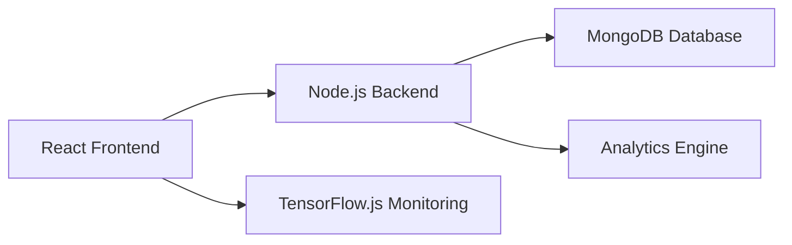

# AI-Powered Online Assessment Platform

  

---

## Overview

A full-stack AI-powered assessment platform designed to modernize online examinations with security, automation, and deep analytics.

Built using the MERN stack, the system enables intelligent test creation, real-time monitoring, and performance-driven insights.

---

## Key Features

* AI-based question generation
* Secure exam environment with anti-cheating controls
* Real-time analytics and leaderboard system
* Role-based access (Admin / Student)
* Webcam-based AI monitoring

---

## System Architecture

---

## Core Modules

### Authentication

* Secure login for Admin and Students
* Role-based access control

---

### AI Question Generator

* Prompt-based MCQ generation
* Automatically creates options and answers
* Answers are securely stored and hidden from users

---

### Admin Dashboard

* Manage and publish assessments
* Monitor student activity
* Access analytics and reports

---

<strong>Analytics Engine (Click to expand)</strong>

* Total number of participants
* Average score
* Question-wise performance analysis
* Identification of difficult questions
* Student-level insights
* Leaderboard generation

---

<strong>Leaderboard System (Click to expand)</strong>

* Ranking based on score and accuracy
* Real-time updates
* Highlights top performers

---

### Student Panel

* Attempt assessments
* Timer-based exam interface
* Auto submission on completion

---

<strong>Anti-Cheating System (Click to expand)</strong>

* Tab switching detection
* Window focus tracking
* Fullscreen enforcement
* Copy/paste and right-click restrictions
* Automatic submission after violations

---

<strong>AI Monitoring (Click to expand)</strong>

* Webcam-based detection using TensorFlow.js
* Detects absence of face
* Detects multiple faces
* Generates a cheating score

---

### Result System

* Score and accuracy calculation
* Performance summary after submission

---

## Data Visualization

* Bar chart for score distribution
* Pie chart for correct vs incorrect answers

---

## Tech Stack

  

---

## Security Design

* Answers are never exposed on the client side
* Admin-only access to analytics
* Controlled exam environment
* Behavior monitoring for integrity

---

## Use Cases

* Educational institutions
* Online certification platforms
* Corporate assessment systems

---

<strong>Future Enhancements (Click to expand)</strong>

* Integration with LLMs (OpenAI / Gemini)
* Live proctoring with video recording
* Cloud deployment (AWS / Vercel)
* Mobile responsive interface

---

## Author

Arun M
AI & Data Science Student

---

## Final Note

  <i>Designed to bring intelligence, fairness, and insight into digital assessments.</i>

